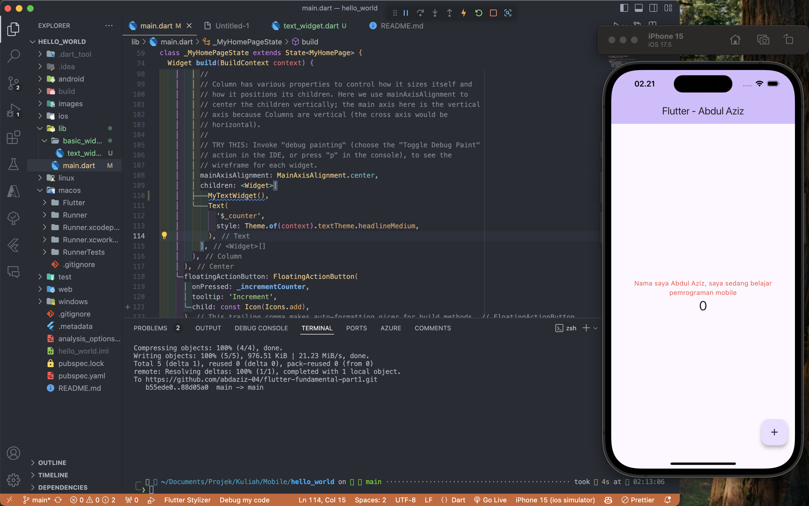
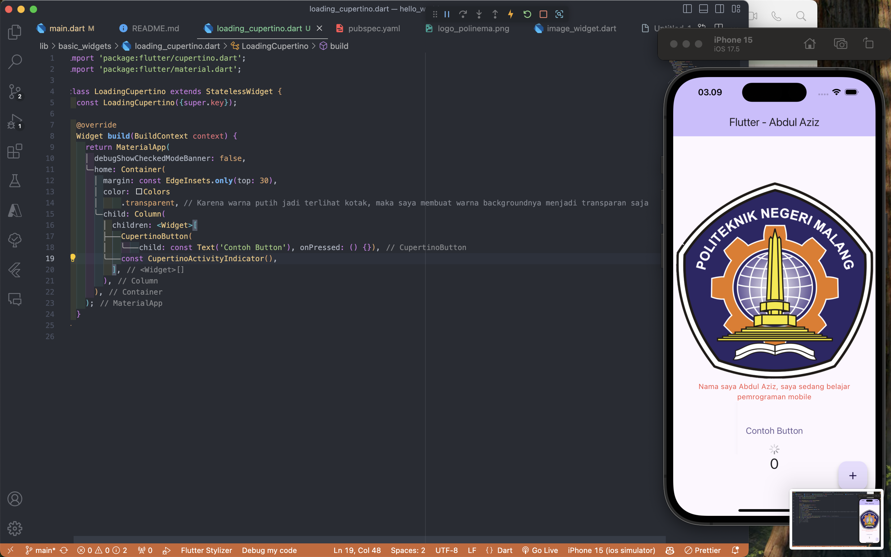
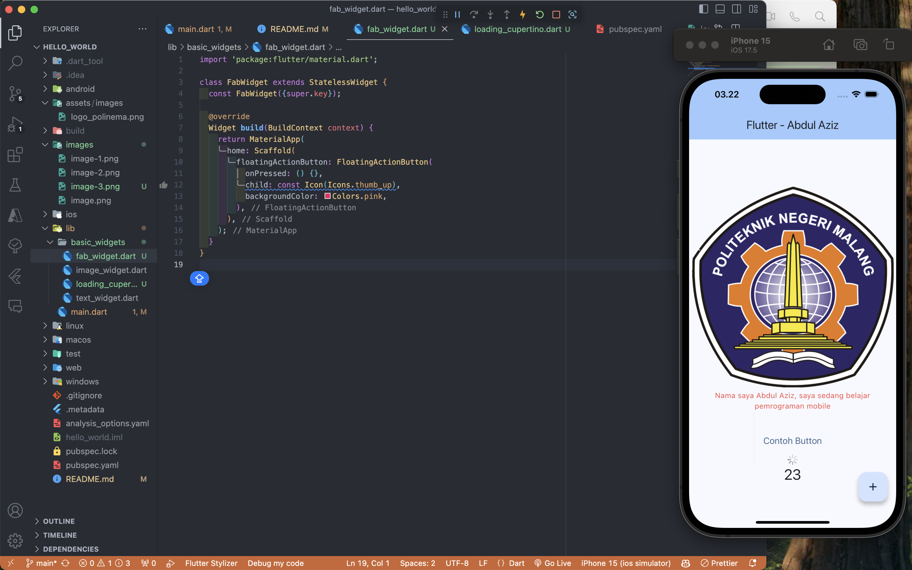
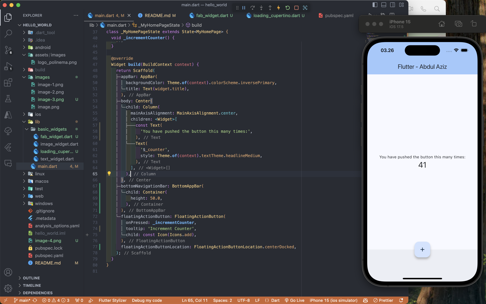
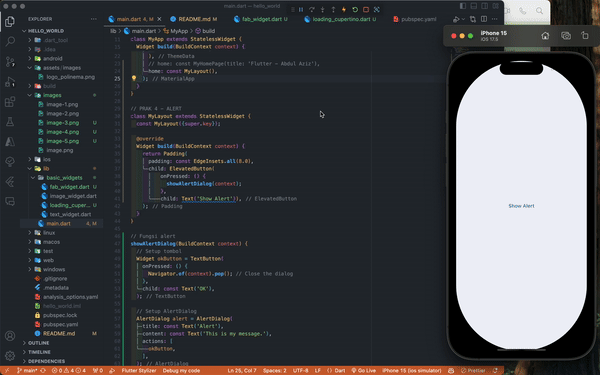
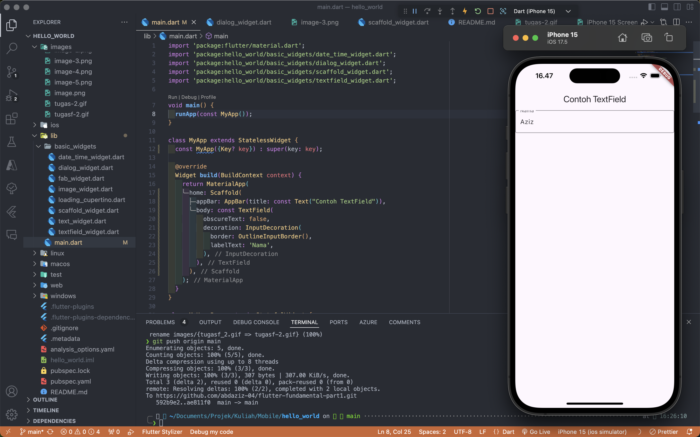
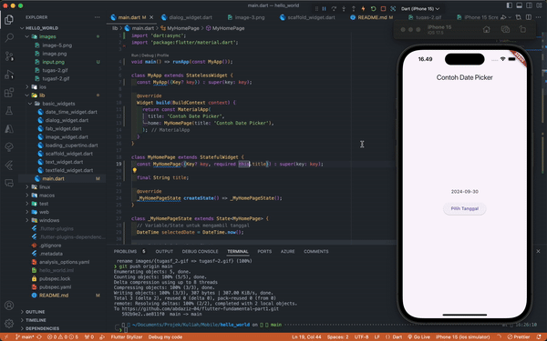
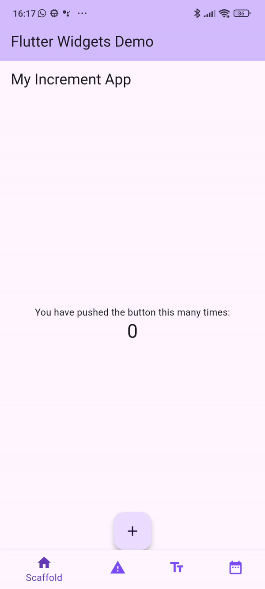

# hello_world

A new Flutter project.

# Praktikum 4 - Terapkan dasar widget

# Praktikum 4 - Terapkan images

# Praktikum 5 - Terapkan Cupercino Button dan Loading Bar

# Praktikum 5 - FAB

FAB tidak saya import karena mengikuti jobsheet

# Praktikum 5 - Scaffold

# Praktikum 5 - Alert

# Praktikum 5 - Input

# Praktikum 5 - Date Time

# TUGAS

Pada praktikum 4 mulai dari Langkah 3 sampai 6, buatlah file widget tersendiri di folder basic_widgets, kemudian pada file main.dart cukup melakukan import widget sesuai masing-masing langkah tersebut!

- Pada Emulator
  

- Device Fisik
  
