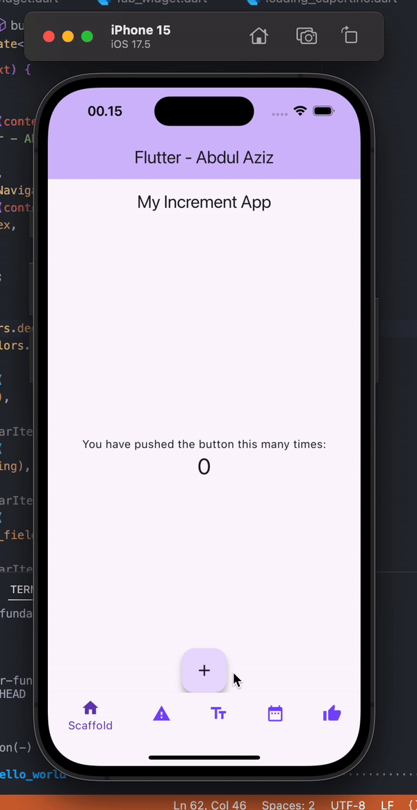

# hello_world

A new Flutter project.

# Praktikum 3 - Terapkan dasar widget

# Praktikum 3 - Terapkan images

# Praktikum 4 - Terapkan Cupercino Button dan Loading Bar

# Praktikum 4 - FAB

FAB tidak saya import karena mengikuti jobsheet

# Praktikum 4 - Scaffold

# Praktikum 4 - Alert

# TUGAS

Pada praktikum 4 mulai dari Langkah 3 sampai 6, buatlah file widget tersendiri di folder basic_widgets, kemudian pada file main.dart cukup melakukan import widget sesuai masing-masing langkah tersebut!

