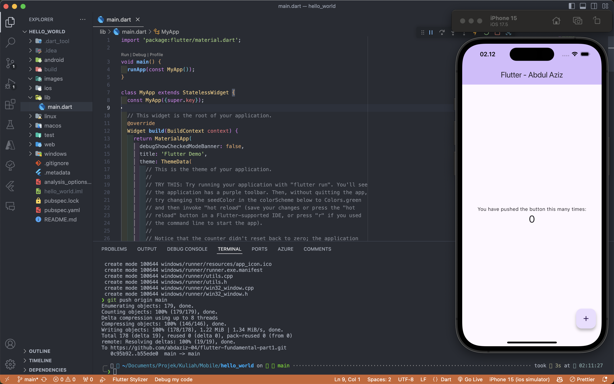
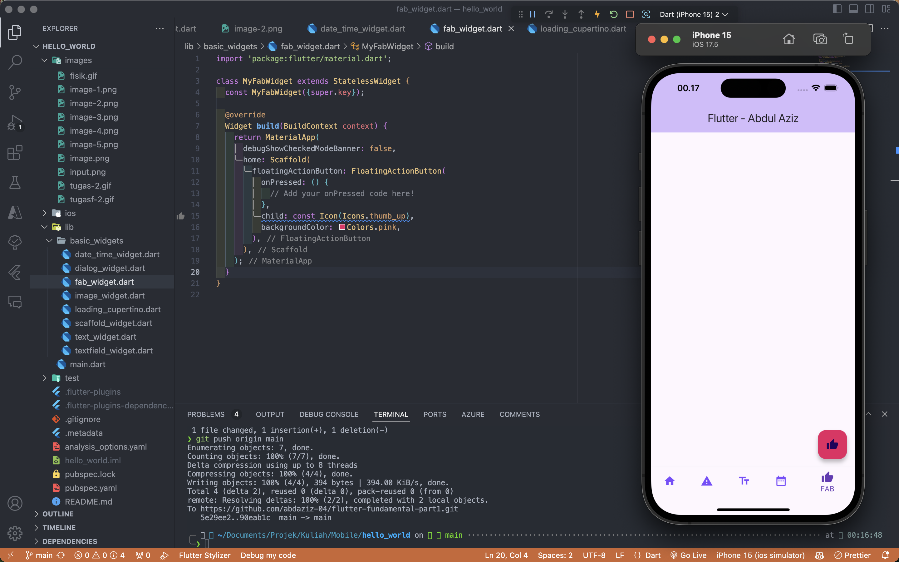
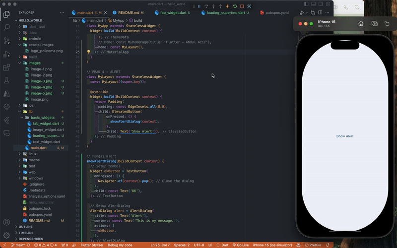

# hello_world

A new Flutter project.

# Praktikum 3 - Terapkan dasar widget

# Praktikum 3 - Terapkan images

# Praktikum 4 - Terapkan Cupercino Button dan Loading Bar

# Praktikum 4 - FAB

FAB tidak saya import karena mengikuti jobsheet

# Praktikum 4 - Scaffold

# Praktikum 4 - Alert

